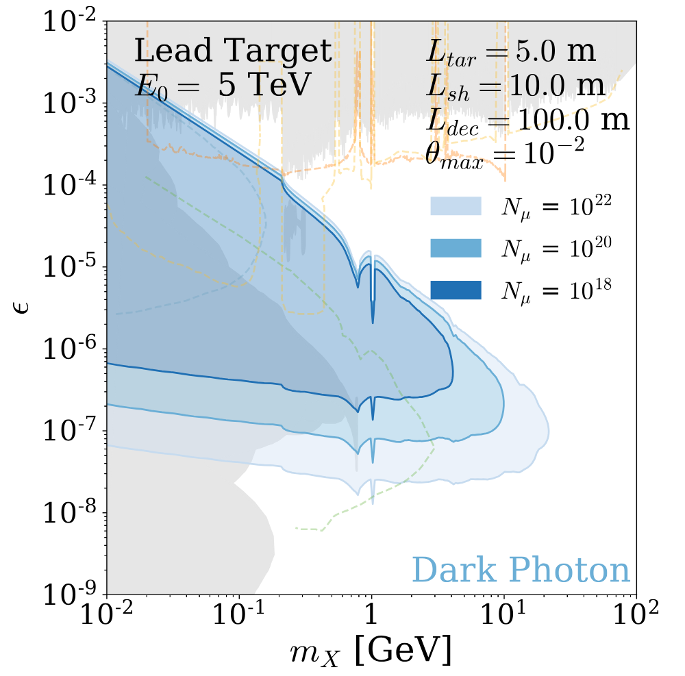

# Muon Beam Dump Calculations and Plots
### v0.0.3

Code by Rikab Gambhir

In collaboration with Cari Cesarotti

<!-- Image -->

# Usage

For the full analysis pipeline, see `muon_beam_dump.ipynb`. This pipeline automates cross section calculations, event yield calculations, and contour plot making. Within this notebook, you can set analysis config parameters.

For the specific models considered in `XXXX.XXXX`, and to reproduce all result plots within the paper, see the notebook `models.ipynb`. Previous exclusion limit datafiles can be placed in the OtherSearchesDigitized directory, some of which are included in this repository.

To reproduce the cross section plots specifically, see `cross_section_plots.ipynb`. To regenerate the cross section datafiles, see `cross_sections.py`, which can also be run within `muon_beam_dump.ipynb`. 

The material property studies performed in this appendix can be reproduced with the notebooks `material_properties.ipynb` and `radiation.ipynb`. The former is for the material property studies in the main text, and the latter is for the material property studies in the appendix.

# Dependencies

Only standard python dependices (numpy, matplotlib, etc) are used. You may need to `pip install tqdm` which is a less-common python package for loading bars.

The major dependencies can be installed with `pip install -r requirements.txt`.

# Changelog
* v0.0.3: 23 October 2023. Public release.
* v0.0.2: 13 June 2023. Exclusion plots.
* v0.0.1: 30 May 2023. Uploaded to private repo.
